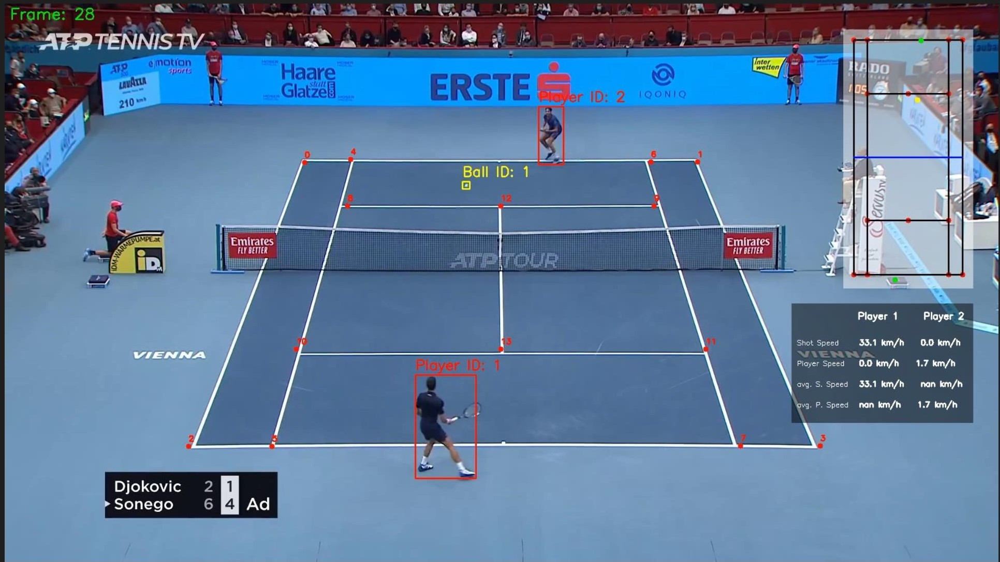

# 🎾 Advanced Tennis Game Analysis with Computer Vision

An advanced **Computer Vision and Deep Learning** project that performs **real-time tennis match analysis** from video footage.  
It automatically detects **players and the tennis ball** to calculate key metrics such as player speed, ball speed, and rally shot count — transforming raw video into actionable insights.

---

## 📸 Project Demo

Here’s a sample output frame showing real-time tracking and analytics:



The output video includes:
- Bounding boxes for players and the tennis ball  
- Real-time statistics overlay (player speed, ball speed, and shot count)  
- Court line detection and calibration for accurate perspective

---

## ✨ Key Features

- 🎯 **Player Detection & Tracking** — YOLOv8 detects and tracks players across frames.  
- 🧠 **Ball Tracking** — Fine-tuned YOLOv5 model handles the high-speed ball reliably.  
- ⚡ **Speed Calculation** — Computes both **player speed** and **ball shot speed**.  
- 🔢 **Automated Shot Counting** — Counts rally shots automatically.  
- 🏟️ **Court Keypoint Detection** — Custom CNN identifies tennis court geometry for perspective correction.  
- 📊 **Real-Time Visualization** — Draws bounding boxes, speed indicators, and trail lines directly on the video.

---

## 🛠️ Tech Stack

| Component | Technology / Library |
|-----------|----------------------|
| **Core Framework** | Python 3.8+ |
| **Computer Vision** | OpenCV |
| **Object Detection** | Ultralytics YOLOv8 (Players), Fine-tuned YOLOv5 (Ball) |
| **Deep Learning** | PyTorch (Custom CNN for Court Keypoints) |
| **Data Handling** | NumPy, Pandas |

---

## ⚙️ Project Structure

tennis-analysis/
│
├── models/ # Pre-trained YOLO and CNN models
│ ├── yolo_ball.pt
│ └── court_keypoints.pt
│
├── training/ # Jupyter Notebooks for model training
│ ├── tennis_ball_detector_training.ipynb
│ └── tennis_court_keypoints_training.ipynb
│
├── output_videos/ # Folder for processed output videos
│
├── utils/ # Utility scripts (e.g., speed calc, visualization)
│
├── main.py # Entry point for video analysis
├── requirements.txt # List of dependencies
└── README.md # Project documentation


---

## 💾 Pre-trained Models

| Model | Description | Download Link |
|-------|-------------|---------------|
| 🎾 **YOLOv5 Tennis Ball Detector** | Fine-tuned for high-speed tennis ball tracking | [Download](https://drive.google.com/file/d/1UZwiG1jkWgce9lNhxJ2L0NVjX1vGM05U/view?usp=sharing) |
| 🏟️ **Tennis Court Keypoint Model** | Custom CNN for detecting court geometry | [Download](https://drive.google.com/file/d/1YJFywO4-hS3vXHNAiBZlNxtwLlmpAymT/view?usp=sharing) |

> Place both `.pt` model files in the `models/` directory after downloading.

---

## 🧠 Model Training

| Task | Notebook | Description |
|------|----------|-------------|
| 🎾 **Tennis Ball Detector (YOLO)** | `training/tennis_ball_detector_training.ipynb` | Fine-tunes YOLOv5 for precise ball detection |
| 🏟️ **Court Keypoint Extractor (CNN)** | `training/tennis_court_keypoints_training.ipynb` | Trains a PyTorch model for court line and point extraction |

---

## 💻 Installation & Setup

### 1️⃣ Prerequisites
- Python 3.8 or newer  
- `pip` and `venv` for package management

### 2️⃣ Clone the Repository
```bash
git clone https://github.com/SuyashJoshi007/Tennis_Game_Analysis.git
cd Tennis_Game_Analysis

3️⃣ Set Up Virtual Environment

python -m venv venv
source venv/bin/activate      # On Windows: venv\Scripts\activate

4️⃣ Install Dependencies

pip install -r requirements.txt

5️⃣ Download Models

Create a models/ directory and place the downloaded .pt files inside.
▶️ Running the Analysis

To process a video:

python main.py --video_path "path/to/your/tennis_video.mp4"

✅ The processed video with analytics will be saved in:

output_videos/

📋 Example Metrics Calculated
Metric	Description
Player Speed (m/s)	Calculated using movement across frames
Ball Speed (km/h)	Estimated post-impact using frame differences
Rally Shot Count	Automatically counts each ball hit
Court Geometry	Used for perspective correction and accurate measurement
🔮 Future Scope

    🖥️ Real-Time Dashboard: Create a live analytics web dashboard

    🧍‍♂️ Pose Estimation: Analyze serve form, footwork, and shot technique

    📈 Advanced Stats: Add metrics like rally duration, shot type classification, and player court coverage

🌟 Acknowledgements

    🧠 Ultralytics YOLOv8

— Object Detection

⚙️ PyTorch

— Model Training and Inference

🎥 OpenCV

    — Image and Video Processing

📄 License

This project is licensed under the MIT License.
You’re free to use, modify, and contribute — just give credit to the original author.
